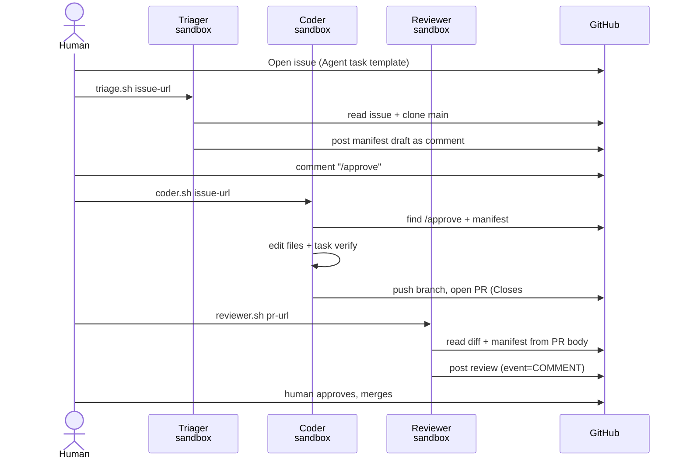
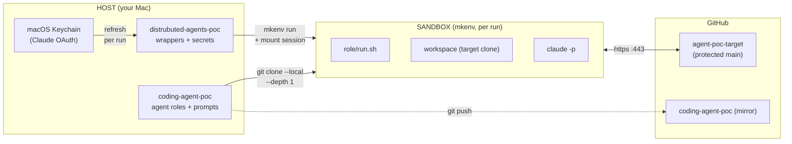
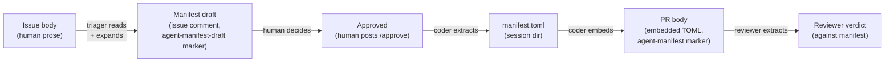

# Agent POC — architecture flow

Three diagrams describing the issue-driven coding-agent POC that produced
the PRs in this repo. Rendered by GitHub natively.

---

## 1. Lifecycle — issue to merge

---

## 2. Topology — three zones

---

## 3. Manifest as contract — where it lives across the lifecycle

---

## Key properties

- **Three sandboxes, three roles** — each run is its own mkenv container, no shared state between roles
- **GitHub-native plumbing** — every artifact is an issue, comment, PR, or review. No parallel tracking system
- **Manifest is the contract** — survives from issue comment → PR body → reviewer context, traceable end-to-end
- **Human gates merges** — reviewer can never approve (`event: COMMENT` is a hard API gate), CI never auto-merges
- **Agent repo cloned per session** — `agent.sha` recorded in session dir for reproducibility; agent code is versioned software
- **Credentials short-lived** — OAuth tokens refreshed from macOS Keychain before every run, never committed, mounted read-only in the sandbox
